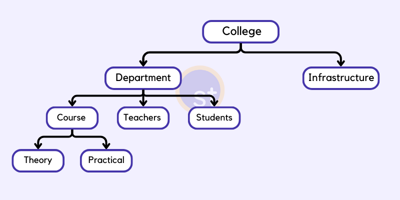
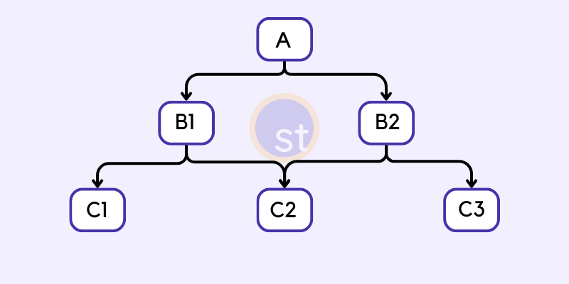

# Fundamentos de Modelagem e Projeto de Banco de Dados

## Mundo Fechado e Mini-Mundo

**Mundo Fechado** é uma soposição que afirma que qualquer informação que não esteja presente no banco de dados é falsa por padrão. Ou seja, se ela não pode ser derivada do banco de dados, é falsa. CWA (Closed-World Assumption) se relaciona com a lógica de predicados que se relaciona com a algebra relacional.

**Mini-Mundo** é um conceito que refere-se a um segmento específico do mundo real que é representado em um banco de dados. Cada objeto no mini-mundo tem suas próprias propriedades e relações com outros objetos.

## Algebra Relacional

> **Predicado** é a parte da oração que contém o verbo e que traz informações sobre o sujeito

A lógica de predicados, também conhecida como lógica de primeira ordem, é uma extensão da lógica proposicional que lida com predicados, quantificadores e variáveis.

$\forall x, P(x) \to Q(x)$: Para todo x; se x é/pode/etc. P, então X é/pode/etc. Q;

A algebra relacional é uma linguagem formal para consulta/extração de dados. Define um conjunto de operações constituidas de operações de conjuntos e operações de banco de dados relacional.

A operação de seleção na álgebra relacional é um exemplo de onde a lógica de predicados é aplicada. A seleção é usada para escolher linhas em uma tabela que satisfazem uma determinada condição. Essa condição é expressa como um predicado.

$\forall x, Estudantes(x) \to Idade(x) > 20$: Para todo x; se x é um estudante, então a idade de x é maior do que 20.

## Modelagem

[https://www.studytonight.com/dbms/database-model.php](https://www.studytonight.com/dbms/database-model.php)

Hierárquico

Rede

Entidade-Relacionamento

Relacional

- O que se quer representar?
  - Implementação;
  - Modelo;
  - Arquitetura;
  - Funcionalidades;
- Cenários:
  - E-commerce;
  - Universidade;
  - Produção;
  - Banco/Financeiro;
  - Farmácia;
  - Bibliotecas;
  - Colaboradores;
- Desenvolvimento da modelagem:
  - Conceitual;
  - Lógico;
  - Físico;
- Criação do modelo e linguagens de modelagem de dados:
  - Gráficas;
  - Textuais;

## Projeto Conceitual

- Coleta de Dados e Análise: requisitos, perguntas a serem respondidas, visões;
- Modelo Entidade Relacionamento e UML de classes;
- Modelo de Alto Nível: a partir dos requisistos, separar requisitos funcionais ( o que executar, quais processos) e não funcionais (segurança, desempenho);

## Projeto Lógico

- Organização dos dados está baseada na estrutura definida pelo SGBD;
  - MySQL: Relacional, dados organizados em tabelas com linhas e colunas;
  - Cassandra: NoSQL Wide Column Store, os dados são organizados em famílias de colunas;
  - MongoDB: NoSQL orientado a documentos, formato Binary JSON;
- Mapeamento entre o Projeto Conceitual e o Projeto Lógico resultando no Esquema de Banco de Dados;
- Percurso com MySQL:
  - Criação do Esquema Lógico;
  - Instalação e Configuração do SGBD;
  - Criação do Esquema do BD;

## Projeto Físico

- Extremamente ligado aos SGBDs;
- Parâmetros Físicos (Estrutura, Segurança, Organização de Arquivos, ...);
