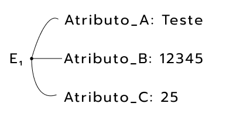

# Modelo de Entidade Relacionamento com Banco de Dados

## Modelo ER

- Domínio do Negócio:
  - Modelo Conceitual:
  Entidades, Relacionamentos e Atributos;

  

  

**Entidades**: objeto básico quue o modelo ER representará;

- Algo no mundo real com uma existência independente;
- Possuindo existência fisica ou conceitual, cada entidade possui atributos (propriedades específicas que a descrevem);
- Uma **entidade fraca** é uma entidade cuja existência depende de outra. Se a entidade forte for removida, em cascata a entidade fraca também é removida.

**Atributos**: Características/Descrição das entidades;

- **Simples** (Atômicos): atributo básico, não divisível.
- **Compostos**: Atributos que podem ser divididos (se necessário) em subpartes menores com significados independentes.
- De **Valor Único**: Valor único para uma entidade particular.
- **Multivalorados**: Possui um conjunto de valores para uma mesma entidade.
- **Armazenados**: Atributos que dificilmente irão se modificar (data de aniversário).
- **Derivados**: Atributo relacionado com dois ou mais valores de atributos (idade);
- **NULL**: Atributo quando uma entidade em particular pode não ter um valor aplicável.
- **UNKNOWN**: Atributo que representa um item faltante;
- **Complexos**: Atributos que permitem a representação de atributos compostos (parênteses) e multivalorados (chaves) de forma aninhada.

**Relacionamentos**: Representam associações entre entidades. Sempre que um atributo de um tipo de entidade se refere a outro tipo de entidade, essa referência não deve ser representada como atributo, mas como relacionamento.

> Um tipo de relacionamento R entre n tipos de entidade $E_1, E_2, ..., E_n$ define um conjunto de associações (relacionamento) entre as entidades desses tipos de entidade.

Classificação:

- **Grau**: número dos tipos de entidade participantes.
- **Auto-Relacional**: se relaciona com a própria entidade ou com outra(s).
- **Atributo**: atributos agem como referências entre entidades.
- **Cardinalidade**: corresponde ao número máximo de instâncias que participam de um determinado relacionamento. M se relaciona com quantos de N;
  - "1:N": Cada departamento pode estar relacionado a N funcionários, cada funcionário pode estar relacionado a 1 departamento.
  - Cardinalidades possíveis para relacionamentos binários são "1:1", "1:N", "N:1" e "M:N".

SUPERVISAO relaciona um funcionário a um supervisor, no qual as entidades funcionário e supervisor são membros do mesmo conjunto entidade FUNCIONARIO. Logo, o tipo de entidade FUNCIONARIO participa duas vezes na SUPERVISAO: uma vez no papel de supervisor (ou chefe) e outra no papel de supervisionado (ou subordinado).

Linhas marcadas com 1 representam a função de supervisor, e as marcadas com 2 representam a função de supervisionado. Assim, f1 supervisiona f2 e f3; f1 é supervisionado por f5; e f5 supervisiona f1 e f4.

**Constraints/Participação**: as restrições de participação determinam se a existência de uma entidade depende de sua associação com outra entidade por meio de um relacionamento. são também conhecidas como restrições de cardinalidade mínima.

- **Total** (linha dupla): uma entidade está totalmente envolvida em um relacionamento. Isso significa que ela deve participar de pelo menos uma instância desse relacionamento.
- **Parcial** (linha simples): uma entidade pode participar parcialmente de um relacionamento. Isso significa que ela pode existir sem estar associada a outra entidade.

**Atributos de Relacionamento**: atributos que por conveniência são transferidos para os relacionamentos.

- Os atributos dos tipos de relacio namento 1:1 ou 1:N podem ser migrados para um dos tipos de entidade participantes.
- Para relacionamento M:N, alguns atributos podem ser determinados pela combinação de entidades participantes em uma instância de relacionamenot, e não por qualquer entidade isolada. Precisam ser especificados como atributos de relacionamento.

## Refinando ER

Relacionamentos:

- Empregado x Departamento: Gerencia e Trabalha Para;
- Departamento x Projeto: Controla;
- Empregado x Empregado: Supervisiona;
- Empregado x Projeto: Trabalha Em;
- Empregado x Dependente: Dependentes De;

## Alternativa UML

- Classe/Entidade;
- Atributos;
- Operações;
- Associações/Relacionamentos;
  - Binária;
  - Reflexiva;
  - Associação;
  - Agregação;
- Atributo de Link/Relacionamento;
