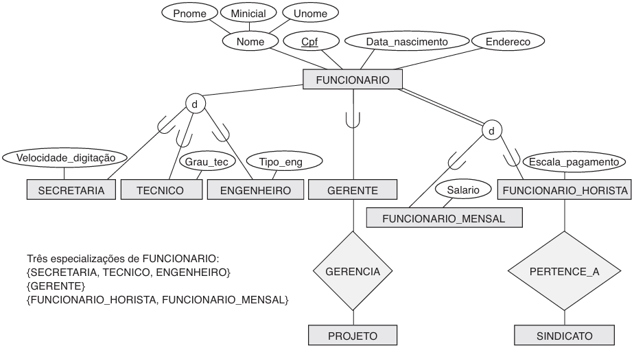
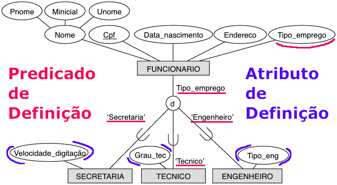
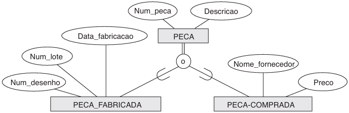
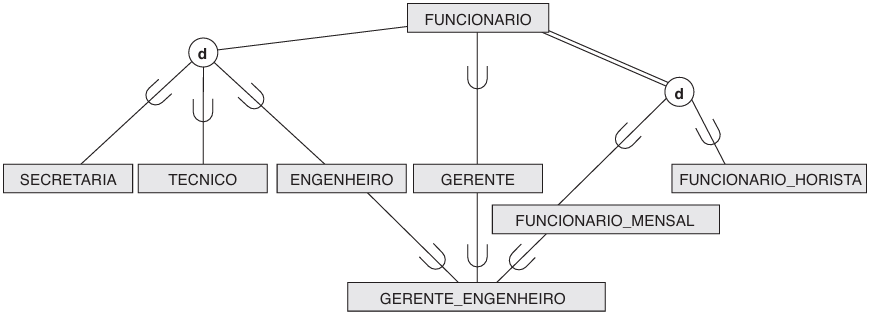
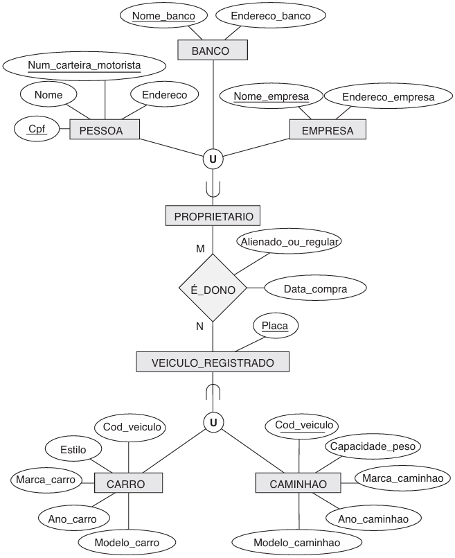

# Modelo Relacionamento de Entidade Aprimorado com Banco de Dados

> Inclui conceitos de ER + conceitos de subclasse, superclasse, categoria/tipo de união e herança.

## Classes

- **Subtipo/Subclasse**: subgrupo de entidades com atributos únicos.
  - Cada subtipo herda os atributos do supertipo, mas também pode ter atributos específicos.
- **Supertipo/Superclasse**: representa uma entidade de nível superior que possui características comuns compartilhadas por seus subtipos.
  - Uma entidade não pode existir no banco de dados simplesmente por ser um membro de uma subclasse; ela também precisa ser um membro da superclasse.
  - Uma entidade pode participar de várias subclasses.
- **Herança**: princípio da POO que permite criar uma nova classe a partir de uma já existente.
  - Entidades de subtipos herdam os valores de supertipos, sendo também instâncias da supertio.

;

- **Especialização**: processo de definir um conjunto de subclasses de um tipo de entidade.
  - Ocorre quando uma entidade é dividida em subconjuntos (representam subtipos) com base em atributos específicos.
  - Excluir uma entidade de uma superclasse implica que ela seja automaticamente excluída de todas as subclasses às quais pertence.
  - Inserir uma entidade em uma superclasse implica que a entidade seja obrigatoriamente inserida em todas as subclasses definidas por predicado (ou definidas por atributo) para as quais a entidade satisfaz o predicado de definição.
  - Inserir uma entidade em uma superclasse de uma especialização total implica que a entidade é obrigatoriamente inserida em, pelo menos, uma das subclasses da especialização.
- **Generalização**: processo oposto ao da especialização.
  - Envolve agrupar entidades semelhantes em uma entidade pai mais geral.

## Restrições

**Subclasses definidas por predicado/condição**: São indicadas por um atributo de definição, uma condição sobre o valor de algum atributo da superclasse.

- Cada entidade pertence a uma subclasse com base em uma condição específica

**Subclasses definidas por atributo**: Se todas as subclasses em uma especialização tiverem sua condição de membro no mesmo atributo da superclasse.

- Todas as entidades com o mesmo valor para esse atributo pertencem à mesma classe.

**Subclasses definidas por usuário**: Quando não há uma condição automática para determinar os membros de uma subclasse.

- Cada entidade pode ser inserida em uma subclasse com base em critérios específicos determinados manualmente, tornando-nas flexíveis.

**Restrição de Disjunção/Desconexão**: especifica que as subclasses da especialização não devem possuir um mesmo membro.

- Uma especialização definida por atributo (e de valor único) implica a restrição de disjunção;
- Notação utilizando um "d" circunscrito;
- Se subclasses não forem restringidas, seus conjuntos podem ser sobrepostos;
  - A **sobreposição** (**overlapping**) indica que uma entidade pode ser membro de uma ou mais classes de especialização;
  - Notação utilizando um "o" circunscrito;

**Restrição de Completude/Totalidade**: especifica como as instâncias da superclasse são ou não atribuídas a uma subclasse.

- **Total**: Toda entidade na superclasse precisa ser um membro de pelo menos uma subclasse na especialização (linha dupla);
- **Parcial**: Permite que uma entidade não pertença a qualquer uma das subclasses (linha simples);

## Hierarquia

Uma **hierarquia de especialização** tem a restrição de que cada subclasse participa como uma subclasse em apenas um relacionamento de classe/subclasse; ou seja, cada subclasse tem apenas um pai, que resulta em uma estrutura de árvore ou hierarquia estrita.

Ao contrário, para um **reticulado** de especialização, uma subclasse pode ser uma subclasse em mais de um relacionamento de classe/subclasse.

Uma subclasse com mais de uma superclasse é chamada de **subclasse compartilhada**, o que leva ao conceito de **herança múltipla**.

## Union Types

O conceito de **Union Types** / **Categorias** representa uma forma de categorização ou agrupamento de entidades.

- A notação de Union Types é representada por um símbolo semelhante a um “U” invertido (∪) em diagramas EER.
- Esse símbolo indica que as entidades pertencem a uma categoria comum, mas não necessariamente compartilham todos os atributos ou relacionamentos.

- `GERENTE_ENGENHEIRO` é uma subclasse de cada uma das três superclasses (`ENGENHEIRO`, `GERENTE` E `FUNCIONÁRIO_MENSAL`):
  - Uma entidade membro de `GERENTE_ENGENHEIRO` deve existir em todas as três superclasses.
  - `GERENTE_ENGENHEIRO` é um subconjunto da interseção das três classes (conjuntos de entidades)
- Em uma **subclasse compartilhada**, `GERENTE_ENGENHEIRO` herda todos os atributos de suas superclasses (**herança múltipla**)

- **Categoria** `PROPRIETARIO` é uma subclasse da união de `PESSOA`, `BANCO`, e `EMPRESA`
  - Uma **categoria** é um subconjunto da união de suas superclasses: Uma entidade que é um membro de `PROPRIETARIO` deve existir em apenas uma das superclasses.
  - Representa a restrição de que um `PROPRIETARIO` pode ser uma `EMPRESA`, um `BANCO` ou uma `PESSOA`.
- Em **categoria**, cada entidade `PROPRIETARIO` herda os atributos de uma `EMPRESA`, uma `PESSOA`, ou um `BANCO`.

- Uma categoria pode ser **total** se mantém a união de todas as entidades em suas superclasses.
  - Uma categoria total é indicada por uma linha dupla que conecta a categoria e o círculo.
- Uma categoria pode ser **parcial** se manter um subconjunto da união.
  - Uma categoria parcial é indicada por uma linha simples.

## Terminologias Alternativas

- Knowledge Representation (KR): Criação de modelos que capturam informações sobre o mundo.
  - Os modelos permitem que sistemas de IA raciocinem, tomem decisões e compreendam o contexto;
- Ontologia: Descrição formal e estruturada de um domínio específico.
  - Define conceitos, relações entre eles e restrições que se aplicam a esses conceitos;
  - Permite representar o conhecimento de forma precisa e padronizada;

## Quiz

### Descrição de uma predicated-define constraint

- Escolha da especialização a ser utilizada depende de um parâmetro. Assim, cada entidade possui um valor associado.
  - Ela significa que a escolha da especialização para uma entidade depende de um valor associado (um parâmetro) que determina qual subclasse ela pertence.
  - Por exemplo, se tivermos uma especialização “Funcionário” com subclasses “Gerente” e “Técnico”, o valor associado (parâmetro) pode ser o cargo (por exemplo, “Gerente” ou “Técnico”).

### Quando modelar utilizando o componente Union Type

- Quando temos uma coleção de objetos que se diferem entre si, contudo, fornecem uma representação do contexto.
  - Union Type permite combinar diferentes tipos de dados em um único tipo.
  - É útil quando há diversos subtipos que compartilham algumas características, mas também possuem diferenças específicas.
  - Pode-se entender como contexto o tipo/classe superior;

### Constraint: Sempre que houver um atributo “x” a persistência será realizada na subclasse “A”

- **Attribute-defined constraint**: O atributo define a especialização.

### Especialização em rede

- Ocorre quando as subclasses, especialização de uma superclasse, são ainda superclasse de outras classes.
  - Rede de hierarquias em que as classes estão interconectadas.

### Distinção de Generalização e Especialização

- Geralmente quando há um processo de especialização da entidade as subclasses compõem todas as subclasses necessárias para aquele contexto.
  - Porque sim.
